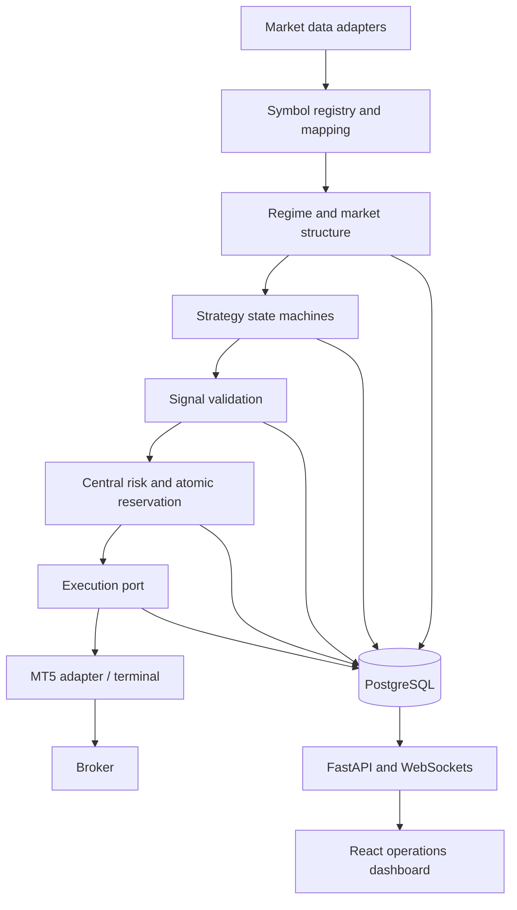

# Platform Architecture

## Goals and boundaries

This repository starts as a research and operations platform, not a live-trading product. Fresh installs run in `paper` mode; the execution interface has no live implementation. Strategies produce proposals only. A central risk service must approve and reserve risk before the execution adapter can receive an order.

## Component map

## Runtime services

- **Trading engine (Python):** deterministic strategy cycles, state machines, structure/regime calculations, risk checks, sizing, portfolio reconciliation and backtesting. Core domain modules must not import web or MT5 libraries.
- **Market data:** normalized OHLCV/quote interfaces, freshness checks and symbol mapping from canonical instruments to broker symbols. Historical and live data adapters share contracts but not assumptions about availability.
- **Execution:** an execution port supports paper simulation first. An MT5 adapter is isolated behind that port. The official MetaTrader5 Python package is Windows/terminal dependent; validate that deployment environment and broker behavior before implementing it. Never queue executable stale signals.
- **API:** FastAPI owns authentication, dashboard commands, read models and WebSocket fanout. State-changing commands are audited and validated server-side.
- **Dashboard:** React/TypeScript operations UI; controls express explicit policies (`disable_new`, `disable_after_position`, `disable_and_close`). Close actions require a separate confirmation flow.
- **Persistence:** PostgreSQL production target, SQLite only for local development where supported. Migrations are versioned. Repository interfaces keep domain logic independent of the persistence engine.
- **Operations:** Windows VPS is the initial MT5 deployment assumption. Docker is suitable for API/database/dashboard components where operationally supported; it is not assumed to host the Windows MT5 terminal.

## Safety invariants

1. A strategy cannot call an execution adapter.
2. Risk validation and capital reservation are one serialized/atomic operation over a current portfolio snapshot.
3. Global stop, bot mode, class/strategy/symbol state, quote freshness, spread, margin and duplicate-signal checks are revalidated immediately before submission.
4. Restart recovery reconciles broker positions before new entries. Unknown or stale intent fails closed.
5. Live mode is unavailable in the initial phase and must require a deliberate future implementation, explicit configuration and operator confirmation.
6. Every candidate, rejection, state transition and operator mutation is attributable and versioned.

## Concurrency and failure behavior

Use a single risk reservation boundary (database transaction/locking or a serialized portfolio actor). Execution requests carry unique signal IDs and expire-at timestamps. Retries query/reconcile by idempotency key before resubmission. A disconnect prevents new entries until health and state reconciliation pass. Position protection must remain broker-side when that capability is eventually validated.

## Data flow and observability

Each cycle records input timestamp and source, computed market state, strategy version/config hash, candidate/rejection reasons, risk snapshot/reservation, and execution result. Health reports engine heartbeat, last quote per symbol, database state, terminal state, and last successful reconciliation. WebSockets are a presentation channel; persisted state remains authoritative.

## Initial deployment shape

Development: Python engine/API, SQLite, paper adapter, dashboard dev server. Production target: Windows VPS with MT5 terminal and engine/adapter, PostgreSQL service, HTTPS reverse proxy and authenticated dashboard. Deployment details remain gated on broker, host, terminal, account and network facts supplied by the operator.
